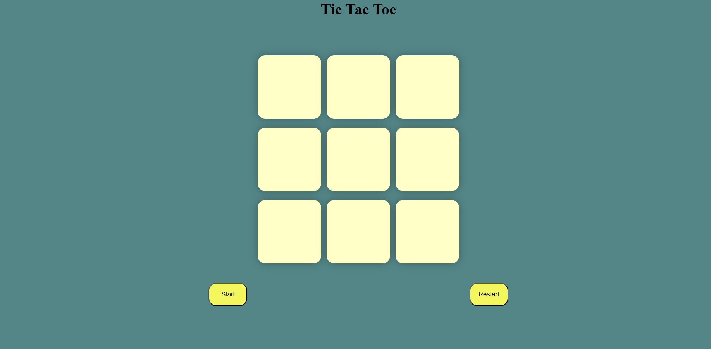

# 🎮 Tic Tac Toe

A simple and fun **Tic Tac Toe** game built using **HTML**, **CSS**, and **JavaScript**.  
Play against a friend on the same device and see who can win the most rounds!

---

## 🔗 Live Demo
👉 [**Play Now**](https://rsccpp.github.io/Tic-Tac-Toe/)  

---

## ✨ Features
- **Two-player mode** – Play with a friend locally.
- **Responsive design** – Works on desktop and mobile.
- **Interactive UI** – Clear turns and winning animations.
- **Restart button** – Quickly reset and start a new game.

---

## 📸 Preview


---

## 🛠️ Tech Stack
- **HTML5** – Structure
- **CSS3** – Styling & animations
- **JavaScript (ES6)** – Game logic

---

## 🚀 How to Play
1. Player **X** always starts first.
2. Take turns placing your mark (`X` or `O`) in an empty square.
3. First player to get **three in a row** (vertically, horizontally, or diagonally) wins.
4. If all squares are filled and no one wins → it's a **draw**.
5. Click **Restart** to play again.

---

## 📂 Project Structure
tic-tac-toe/
│
├── index.html # Main HTML file
├── style.css # Styling for the game
├── script.js # Game logic
└── assets/ # Images/screenshots

---

## 💻 How to Run Locally
1. **Download or clone** the repository:
   ```bash
   git clone https://rsccpp.github.io/Tic-Tac-Toe/
2. Open the index.html file in your browser.
3. Start playing!

---

## 📜 License

This project is open-source and available under the MIT License.

---
